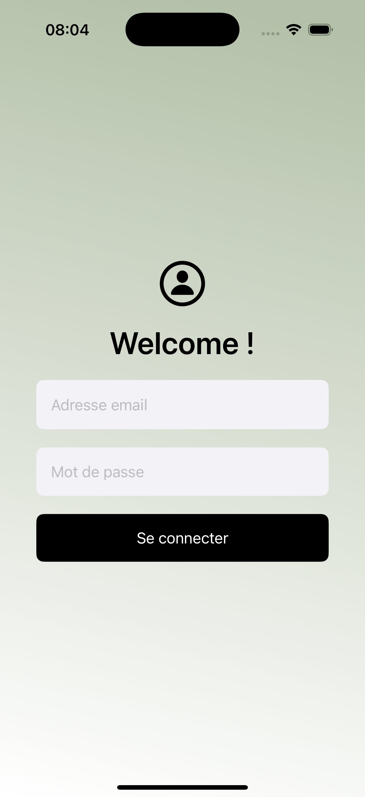
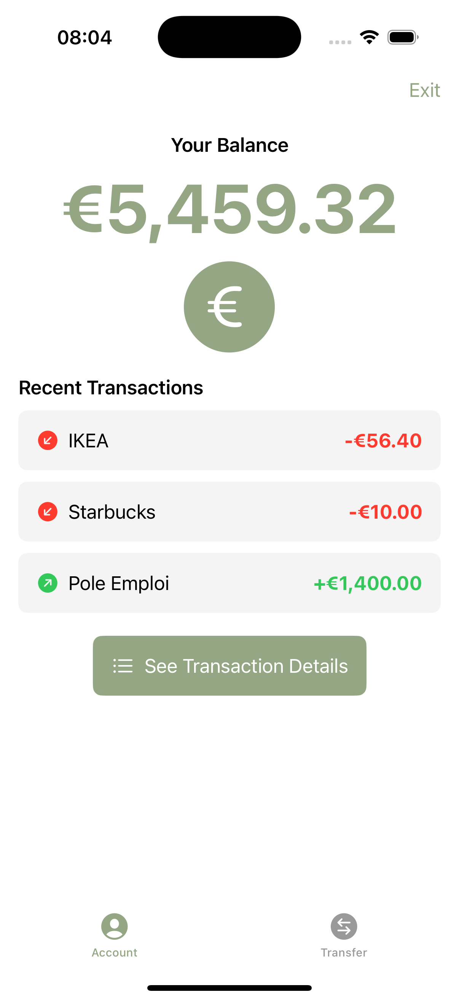
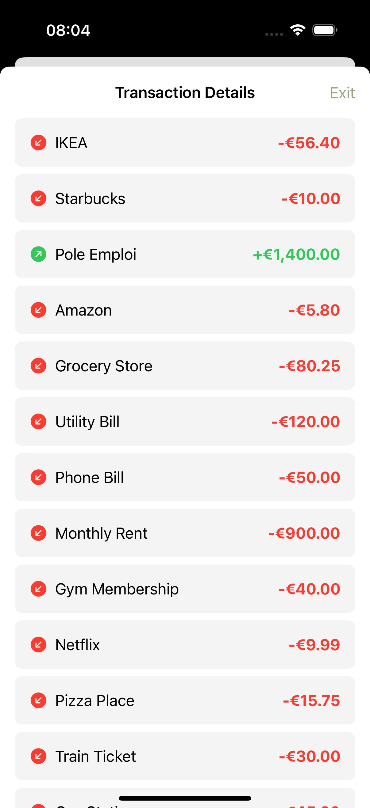
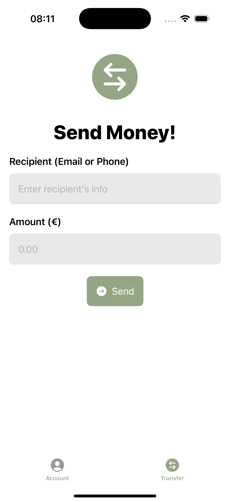

# OpenClassrooms : Implémentez l'accès à des données (externes) pour une application iOS

Ce projet fait partie du parcours "Développeur d'application iOS" d'OpenClassrooms (projet 5).

L'objectif de ce projet consistait à développer tout le modèle de l'application en utilisant l'API fournie par OpenClassrooms.

# Captures d'écran de l'application

<table style="border: none">
  <tr>
    <td align="center">
       
      Authentication View
    </td>
    <td align="center">
       
      Account Detail View
    </td>
    <td align="center">
       
      All Transactions View
    </td>
    <td align="center">
       
      Money Transfer View
    </td>
  </tr>
</table>
